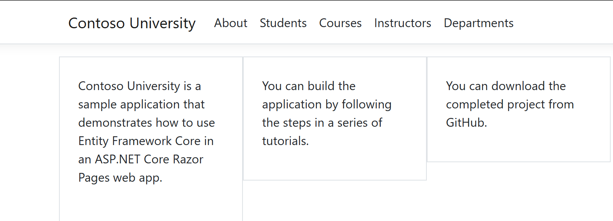
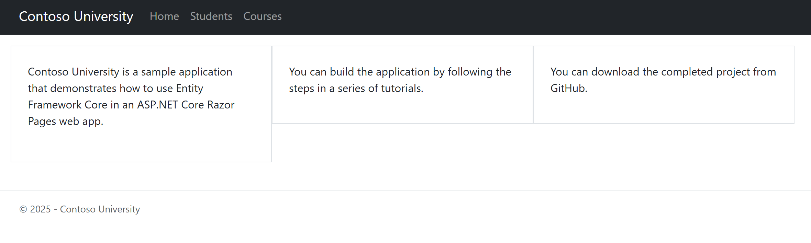
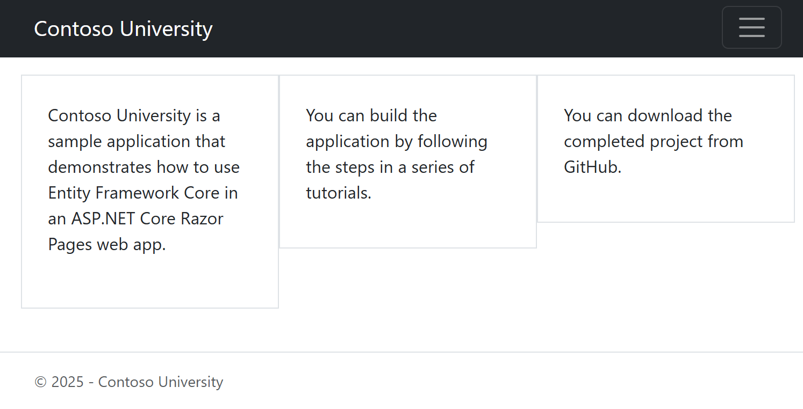
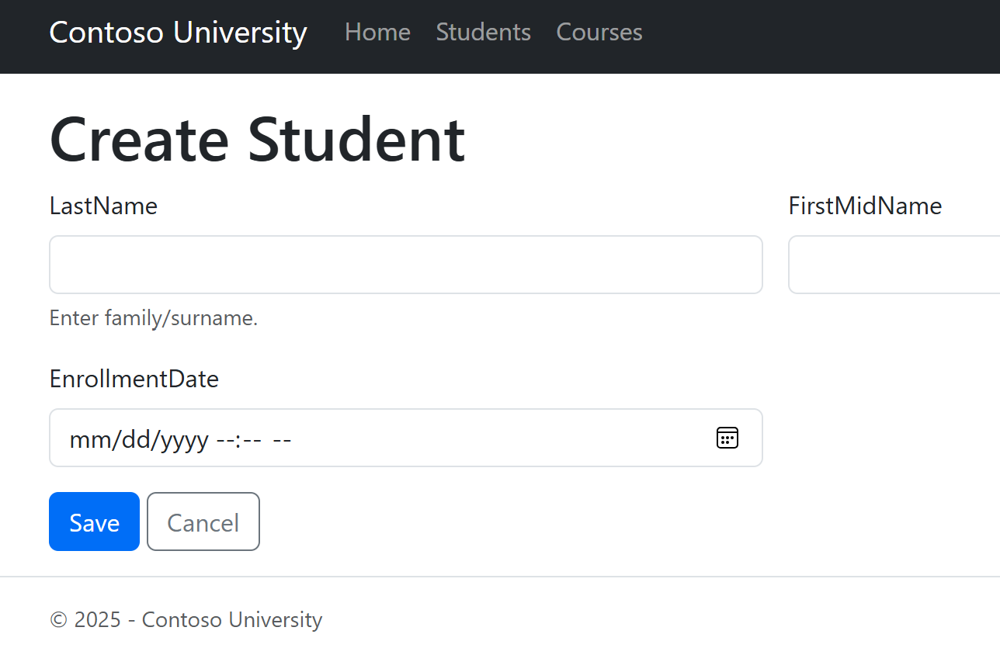
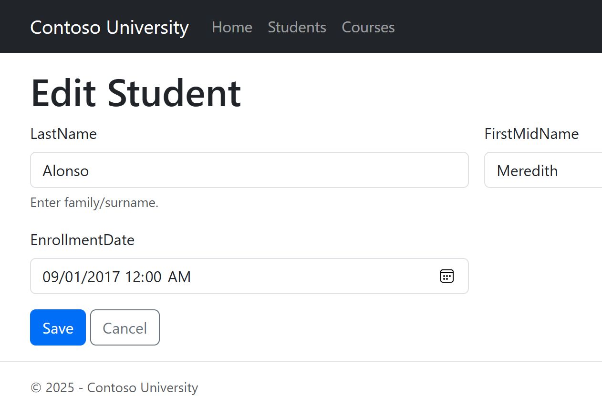
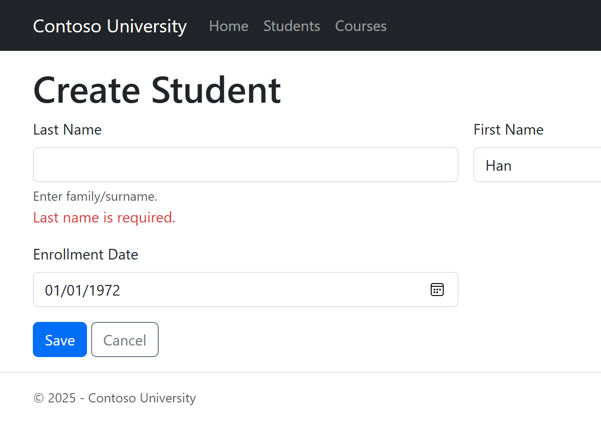
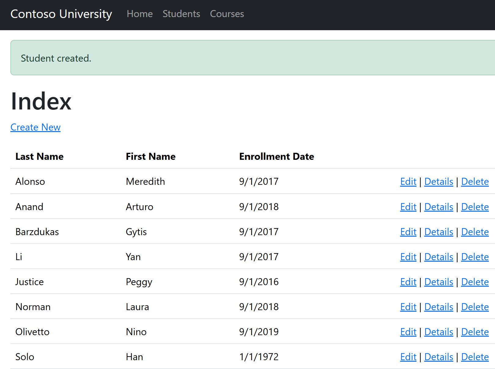

# Contoso University (Razor Pages)

This is a simple ASP.NET Core Razor Pages project based on the Contoso University tutorial.  
It shows how to make a responsive layout, add a navigation bar, use a partial view, and add basic validation.

---

## What it does
- Create, edit, delete, and view students (CRUD).
- Responsive Bootstrap layout with a navbar on all pages.
- Shared `_StudentForm` partial for both Create and Edit.
- Validation with `[Required]` attributes on the Student model.
- Accessibility basics: labels linked to inputs, error messages under fields, skip link, and status messages.

---

## How to run
1. Open the project in **Visual Studio 2022**.
2. Make sure you have **.NET 8 (or newer)** and SQL Server LocalDB installed.
3. Press **F5** to start the app.

---

### Navbar
**Before layout changes**

**After layout changes (desktop)**

**After layout changes (mobile)**

### Forms
**Create form using partial**

**Edit form using partial**

### Validation and Status
**Validation error when Last Name is missing**

**Success status message after save**

---